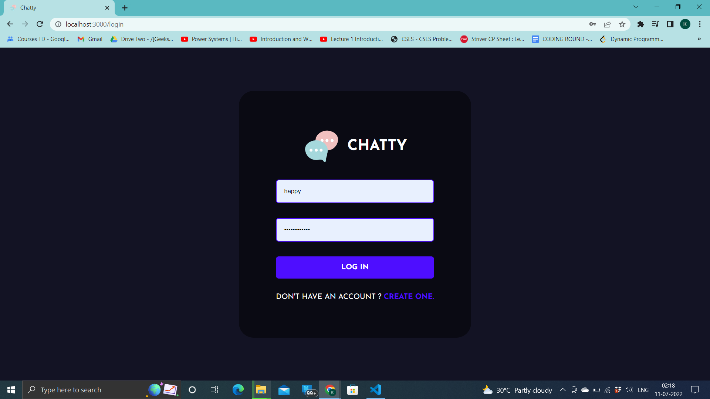
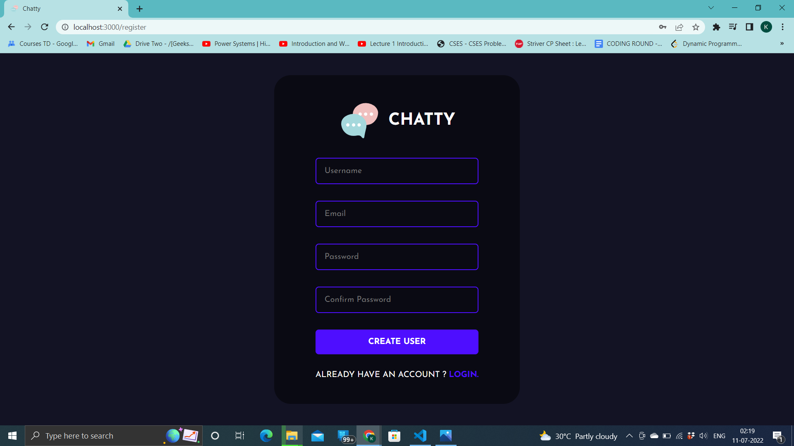

- A full stack messaging prototype webapp where any registered user can connect with any other user registered.
- __Purpose__ : To offer direct access to a user to connect with other users. (Of a particular organization) without going through the hassle of finding their phone numbers via friends. 
- __Technologies used__: React, Node.js, MongoDB, Socket.io, Express 

